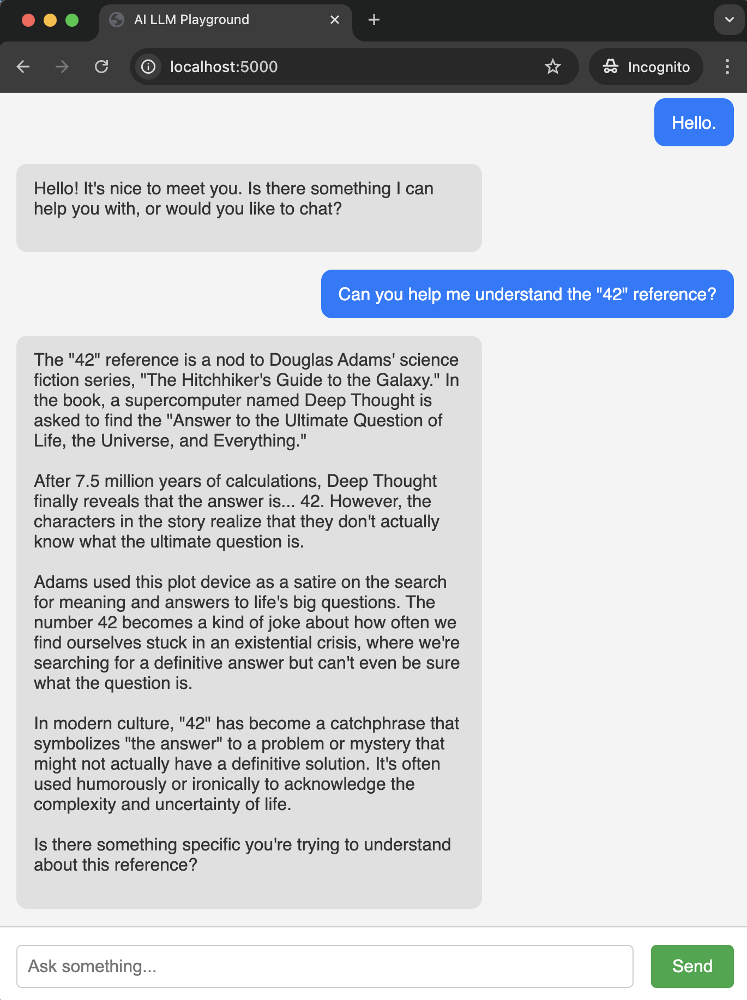

# 🧠 AI LLM Playground

A simple LLM Playground using the Ollama LLM provider to run on your local machine.

Use interactive web playground for experimenting with LLM prompts using a simple HTML + JS frontend and a Python Flask backend.  
Powered by [Ollama](https://ollama.com/) to run local open-source models like LLaMA3, Mistral, and more.

In this project, I used it to run a local offline chatbot on my machine, but you can optimize this code to run the LLM
(or should I say SLM) for any other legitimate purpose. 


---

## ✨ Features

- Text input to interact with local LLMs via Ollama
- Simple browser-based UI (no framework bloat)
- Flask-based API for prompt forwarding
- Docker-ready for local deployment

---

## 🚀 Getting Started

### Prerequisites

- [Ollama installed](https://ollama.com/download) 
- Python 3.10+ and pip
- Docker (optional, for containerized setup)

---

###  Run Locally 

```bash
# Start Flask backend
cd backend
pip install -r requirements.txt
python app.py
```
Then open frontend/index.html in your browser.

### Run With Docker (Recommended)
```bashdocker build -t ai-llm-playground .
docker run -p 5000:5000 ai-llm-playground
```

####  Have fun :) 
